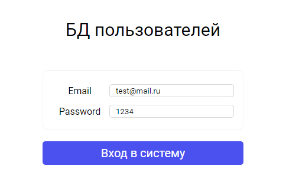
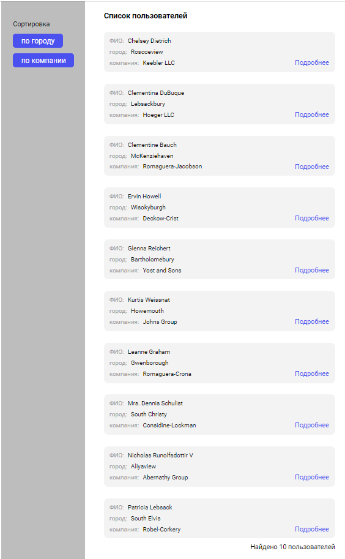
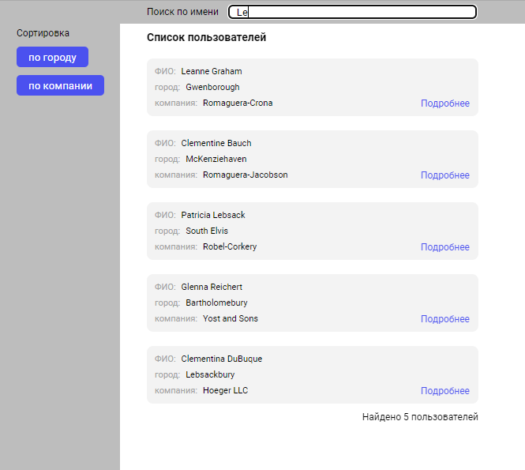
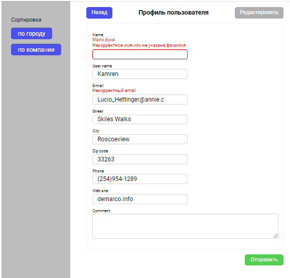

# Roox test

**Demo project:** [roox_test](https://vladzinovev.github.io/roox_test/).

## Краткое описание
У нас есть 10 пользователей, которые получаем через axios запрос. Их мы можем сортировать, искать и редактировать. Так же реализована страница со входом для доступа к пользователям. 

**[Основная страница]** - первое, что видит пользователь. Это вход в приложение. 



Я реализовал вход по email: test@mail.ru, password: 1234. 

## Страница с пользователями



После авторизации мы попадаем в нашу импровизированную БД (но также после изменения профиля, есть вывод в консоль в json формате). На данной странице можно перейти в любой профиль пользователя для редактирования, а также отсортировать пользователей по городу и по названию компании, оба этих параметра сортируются, как по возрастанию, так и по убыванию (по умолчанию я реализовал сортировку по ФИО). 

## Поиск



Также был добавлен поиск по ФИО, после ввода в имени в поиск, отображаются найденные пользователи и их количество, этих же пользователей мы можем отсортировать по городу и по компании. После того как удаляем данные из поисковика, отображается исходное количество пользователей.

## Страница редактирования



На странице редактирования мы можем изменить предоставленные нам поля, но только после нажатия кнопки "редактировать", кнопка отправить не доступна. Как только нажали редактировать, получаем доступ к изменению полей, на каждое поле добавлена валидация на пустоту, длину символов и корректность ввода (исходя из данных https://jsonplaceholder.typicode.com/users). Если какое-то поле не правильно заполнено, то кнопка "отправить" не будет срабатывать для отправки данных. После того как все правильно ввели, нажимаем "отправить", данные формируются в json и выводятся в консоль, помимо этого я реализовал сохранение измененного пользователя в массив. Для того чтобы посмотреть на наши изменения, нажимаем на кнопку "назад", после этого можем потом снова вернуться к этому пользователю и изменения останутся прежними.


[Запрос через axios](https://jsonplaceholder.typicode.com/users) <br>
[Тестовое задание](https://roox.notion.site/frontend-32b79baef66c4ca4a27f6f76e01a7dd2)

## Стек технологий

```
React
TypeScript
Axios
Scss
Redux toolkit
```
